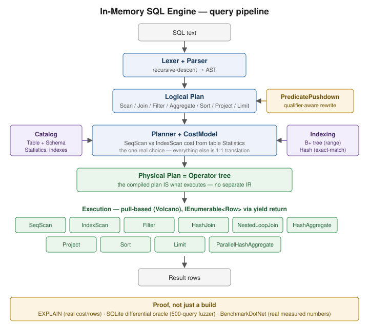
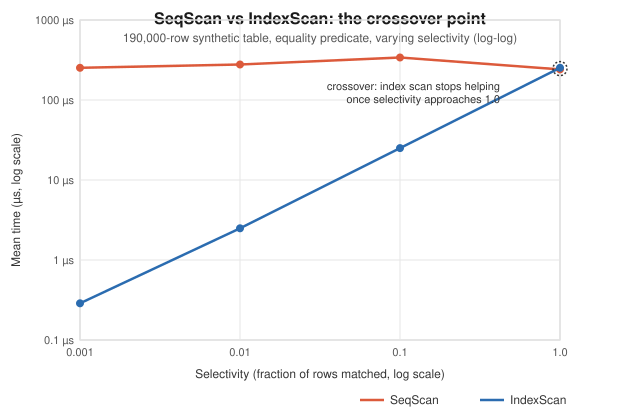
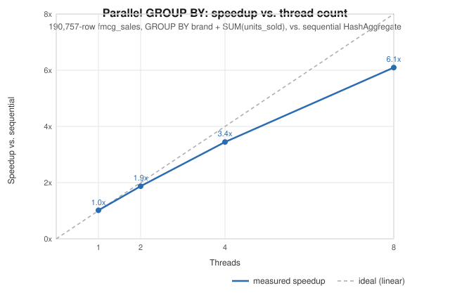

# In-Memory SQL Engine

A SQL query engine built from scratch in C#. It has a hand-written B+ tree index, a cost-based
query planner and a pull-based (Volcano) execution model. It uses no database libraries. SQLite
is used only as a test oracle.

## Why I built this

I had used databases like SQLite and DuckDB as black boxes: write SQL, get rows back. I wanted
to know what happens in between, such as how a planner decides whether to use an index, why
`LIMIT 10` can be instant on a huge table, and how NULL comparisons really work. Building one
from scratch was the best way to find out, and I checked every answer against SQLite.

## Highlights

- **Cost-based planner.** It compares `SeqScan` and `IndexScan` costs using table statistics.
  It turns down its own index when a predicate matches most of the table.
- **Hand-written B+ tree and hash index.** The B+ tree splits nodes and links its leaves for range
  scans. The planner knows what each index supports, so it never sends a range predicate to the
  hash index.
- **Lazy Volcano execution.** Operators stream rows with `yield return`, so `LIMIT 10` stops the
  scan after 10 rows.
- **Differential testing against SQLite.** Every test run executes 500 randomly generated queries
  plus targeted cases against both engines on the full dataset.
- **Correct SQL semantics.** It uses three-valued NULL logic, `EXPLAIN` output annotated with costs,
  and qualifier-aware predicate pushdown.
- **Parallel aggregation.** It partitions the table, aggregates each partition with no shared
  mutable state, then merges the results.

| Benchmark | Result |
|---|---|
| `IndexScan` vs `SeqScan` at selectivity 0.001 (synthetic 190k rows) | **880x faster** |
| `IndexScan` vs `SeqScan` at selectivity 1.0 (synthetic 190k rows) | 0.95x (index is slower, so the planner uses `SeqScan`) |
| Lazy `LIMIT 10` vs materializing the scan (190,757 rows) | **~8,300x faster** |
| Parallel `GROUP BY` at 8 threads (190,757 rows) | **6.1x speedup** |

## Quick start

**Prerequisite:** [.NET 8 SDK](https://dotnet.microsoft.com/download/dotnet/8.0). The version is
pinned in `global.json`.

```bash
git clone https://github.com/nishanthsr7-eng/in-memory-sql-engine.git
cd in-memory-sql-engine
dotnet run --project src/InMemorySqlEngine.Cli
```

The CLI loads every CSV in `data/` as a table named after the file. To use your own data, pass a
directory or individual files:

```bash
dotnet run --project src/InMemorySqlEngine.Cli -- --data path/to/csvs
dotnet run --project src/InMemorySqlEngine.Cli -- sales.csv customers.csv
```

REPL commands: `.tables`, `.schema <table>`, `EXPLAIN <query>`, `.exit`.

## Example

```
sql> SELECT category, COUNT(*) AS n, SUM(s.units_sold) AS total
      FROM fmcg_sales s JOIN brands b ON s.brand = b.brand
      WHERE promotion_flag = 1
      GROUP BY category HAVING COUNT(*) > 100
      ORDER BY total DESC
category  | n     | total
----------+-------+-------
Yogurt    | 11081 | 405969
Milk      | 6551  | 196663
ReadyMeal | 5047  | 171027
SnackBar  | 4749  | 164309
Juice     | 1033  | 31430
(5 rows in 114 ms)
```

> The REPL reads one query per line. The query above is wrapped here only for readability.

### EXPLAIN: the planner choosing between scans

With an index on `sku`, a selective predicate uses the index, and a predicate that matches about
half the table falls back to a sequential scan. The `Project` column list is shortened below.

```
sql> CREATE INDEX ON fmcg_sales(sku)
sql> EXPLAIN SELECT * FROM fmcg_sales WHERE sku = 'MI-006'
Project (...)  (cost=25787.3, est. rows=6359)
  IndexScan on fmcg_sales using BPlusTree index on sku = MI-006  (cost=25469.3, est. rows=6359)

sql> EXPLAIN SELECT * FROM fmcg_sales WHERE promotion_flag = 0
Project (...)  (cost=233677.3, est. rows=95378)
  Filter  (cost=228908.4, est. rows=95378)
    SeqScan on fmcg_sales  (cost=190757.0, est. rows=190757)
```

## Supported SQL

| Feature | Supported |
|---|---|
| Projection | Column list, `*`, `AS` aliases |
| Joins | Any number of `JOIN ... ON a.col = b.col` (inner equi-joins) |
| Filtering | `= != < <= > >=`, `BETWEEN`, `IN`, `IS [NOT] NULL`, with `AND` / `OR` / `NOT` |
| Aggregation | `GROUP BY`, `HAVING`, `COUNT`, `SUM`, `AVG`, `MIN`, `MAX` |
| Ordering | `ORDER BY ... [ASC\|DESC]` (NULLs sort last), `LIMIT n` |
| Commands | `EXPLAIN <query>`, `CREATE INDEX ON table(col) [USING HASH\|BTREE]` |
| Types | `INT`, `DECIMAL`, `TEXT`, `DATE`, `BOOL` (inferred from CSV) |

**Not supported:** `DISTINCT`, subqueries, `UNION`, window functions, `CASE`, arithmetic
expressions, outer or non-equi joins, and writes (`INSERT` / `UPDATE` / `DELETE`). The engine is a
read-only analytical engine. [`docs/design.md`](docs/design.md#1-scope-and-parsing) explains the scope.

## Architecture



SQL text is parsed into an AST and turned into a logical plan. Predicate pushdown rewrites the
logical plan, and the planner compiles it into a tree of physical operators, choosing between
`SeqScan` and `IndexScan` by cost. [`docs/architecture.md`](docs/architecture.md) walks through
each stage.

## Benchmarks





The benchmarks use BenchmarkDotNet's `ShortRunJob` (3 warmup and 3 measured iterations) with a
Release build. That is enough to show the trends but less precise than the default job.
[`docs/benchmarks.md`](docs/benchmarks.md) covers the methodology, the machine spec and every
result.

```bash
dotnet run --project src/InMemorySqlEngine.Bench -c Release -- --filter "*"
```

## Testing

```bash
dotnet test                                    # unit + differential suites (~3 min)
dotnet test --filter "Category!=Differential"  # unit tests only (seconds)
```

The differential suite loads the full dataset into both the engine and SQLite. It runs 500 random
queries and targeted cases, and compares the result sets.

## Project structure

```
src/
  InMemorySqlEngine.Core/                engine: SQL parsing, catalog, indexes, planner, operators, values
  InMemorySqlEngine.Cli/                 interactive REPL
  InMemorySqlEngine.Bench/               BenchmarkDotNet suite
tests/
  InMemorySqlEngine.Tests/               unit tests
  InMemorySqlEngine.Tests.Differential/  SQLite oracle and random query generator
data/                                    sample dataset (see data/README.md)
docs/                                    design notes, architecture, benchmarks
```

## Known limitations

- **Ambiguous unqualified columns after a JOIN are not rejected.** If two joined tables share a
  column name, an unqualified reference resolves to the last one registered. SQLite raises an
  error instead. Qualify the column (`b.category`) whenever a name exists on both sides.
- **`ORDER BY` cannot mix a column outside the SELECT list with a SELECT alias.** This is
  deliberately out of scope (see `Planner.BuildLogicalPlan`).
- **The planner never chooses `ParallelHashAggregate`.** The operator is tested and benchmarked,
  but choosing it automatically would need a cost model for when parallelism pays off. Small
  aggregates lose to the partition and merge overhead.
- **`SqlValue` is wide.** It keeps a separate field for each type, so every cell reserves space for
  all five types. This avoids boxing but costs memory and cache locality during scans. A union
  layout or columnar storage would shrink it.

## Documentation

| Document | Contents |
|---|---|
| [`docs/design.md`](docs/design.md) | Design decisions: scope, Volcano execution, cost model, NULL semantics, testing |
| [`docs/architecture.md`](docs/architecture.md) | A walkthrough of each component |
| [`docs/benchmarks.md`](docs/benchmarks.md) | Methodology, machine spec, all benchmark results |
| [`data/README.md`](data/README.md) | Dataset source and license |
| [`CHANGELOG.md`](CHANGELOG.md) | Release history |
| [`CONTRIBUTING.md`](CONTRIBUTING.md) | How to build, test and contribute |

## Dataset

The sample data is the synthetic [FMCG Daily Sales Data (2022–2024)](https://www.kaggle.com/datasets/beatafaron/fmcg-daily-sales-data-to-2022-2024)
by Beata Faron, released under CC0. It has 190,757 rows and 14 columns.

## License

[MIT](LICENSE)
